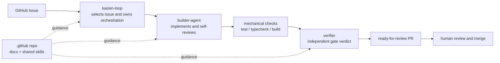
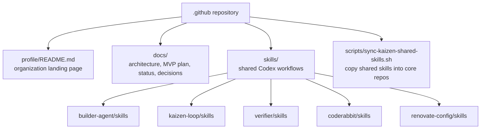

# Kaizen Agents Organization Assets

This repository is the organization-level home for Kaizen Agents documentation, shared skills, and profile content.

It does not run the issue-to-PR pipeline itself. It explains the system, keeps shared workflow skills in one source of truth, and coordinates cross-repository documentation for the core projects.

## System At A Glance

The core rule is:

> Builders build. Verifiers verify. Kaizen Loop coordinates.

## What Lives Here

## Core Repositories

| Repository | Responsibility | Main README |
|---|---|---|
| `kaizen-loop` | Orchestrates GitHub Issue intake, isolated workspaces, checks, verifier calls, PR creation, and run reporting. | <https://github.com/kaizen-agents-org/kaizen-loop> |
| `builder-agent` | Performs implementation work and internal self-review, then returns structured build artifacts. | <https://github.com/kaizen-agents-org/builder-agent> |
| `verifier` | Independently evaluates completed changes and returns a structured gate verdict. | <https://github.com/kaizen-agents-org/verifier> |
| `coderabbit` | Stores shared CodeRabbit review configuration. | <https://github.com/kaizen-agents-org/coderabbit> |
| `renovate-config` | Stores shared Renovate dependency update defaults. | <https://github.com/kaizen-agents-org/renovate-config> |

## Documentation Map

- [docs/README.md](./docs/README.md): documentation index.
- [docs/documentation-sources.md](./docs/documentation-sources.md): source-of-truth order for documentation-backed issue creation.
- [docs/architecture.md](./docs/architecture.md): system responsibilities and end-to-end flow.
- [docs/issue-to-pr-mvp.md](./docs/issue-to-pr-mvp.md): organization-level MVP contract.
- [docs/implementation-status.md](./docs/implementation-status.md): current implementation state.
- [docs/shared-skill-sync.md](./docs/shared-skill-sync.md): how shared skills are distributed.
- [docs/daily-dogfood-sync.md](./docs/daily-dogfood-sync.md): planned daily sync for shared skills and dogfooding contracts.
- [docs/org-monitor.md](./docs/org-monitor.md): cross-repository coordination monitor.
- [docs/design-decisions.md](./docs/design-decisions.md): rationale for the current architecture.

## Shared Skills

The `skills/` directory is the source of truth for shared Kaizen workflows:

- `gh-link-issue-pr`: ensure implementation PRs close their source issues with GitHub closing keywords.
- `kaizen-bug-router`: route Kaizen Agents bug reports to the owning repository.
- `pr-guardian`: monitor an opened PR until it is mergeable or a real blocker remains.

Core repositories vendor these skills so local agents can use the same workflows without depending on this repository at runtime.

## Documentation Source Of Truth

Organization coordination and automated monitor issues should use the organization profile, this README, and the architecture docs as their primary basis. When the monitor creates a follow-up issue, its body should cite the relevant documentation path or URL and explain why that source supports the issue scope. If the docs are stale or contradictory, the monitor should report the drift instead of creating an implementation issue from an assumption.
