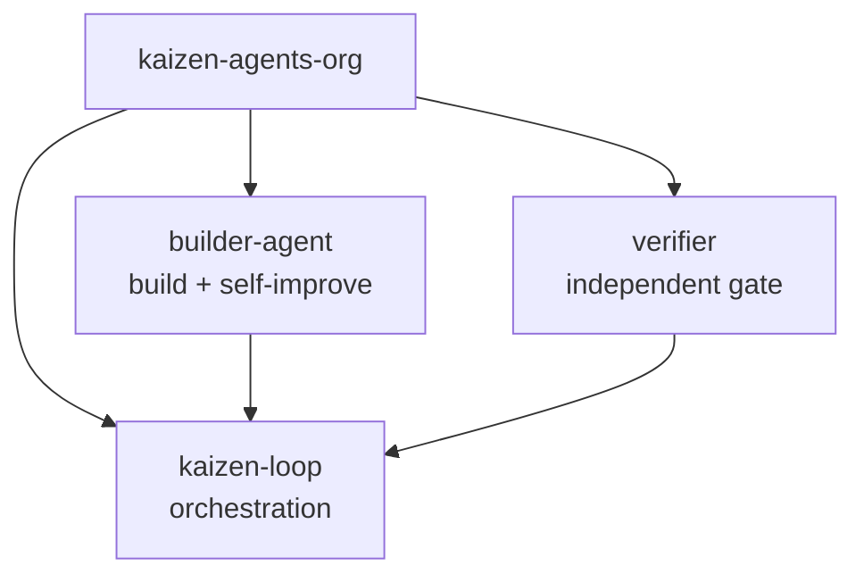
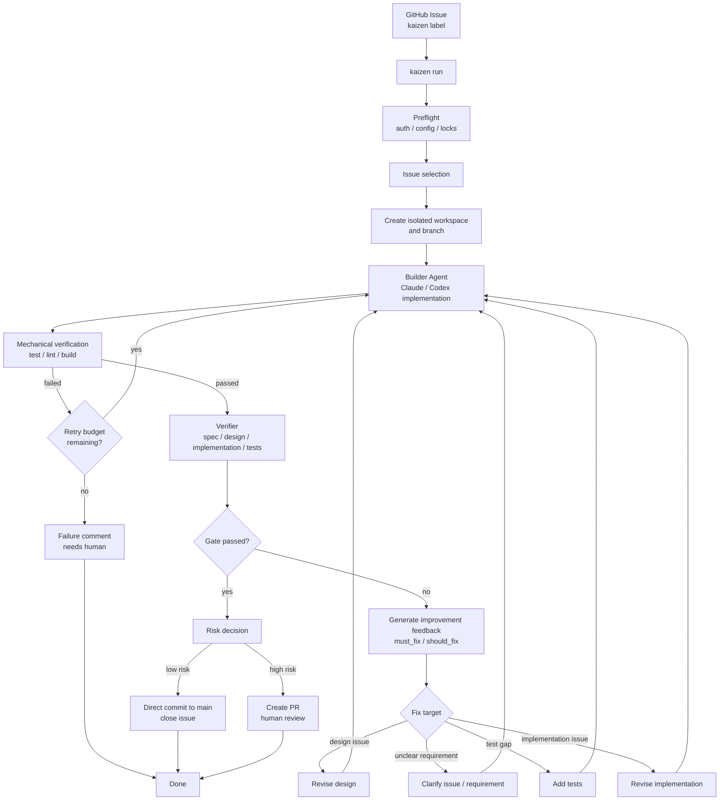
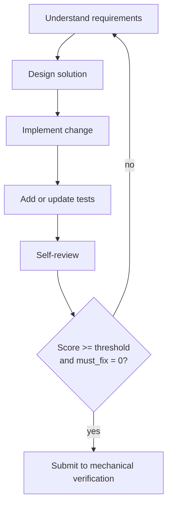
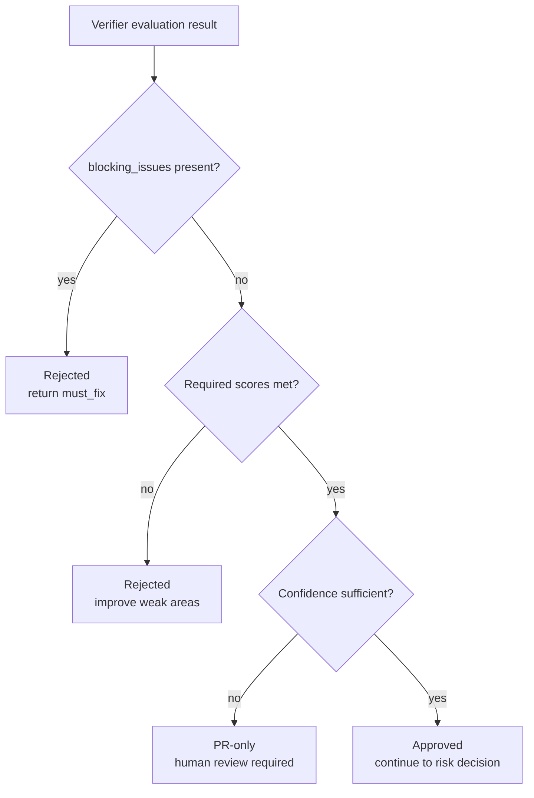
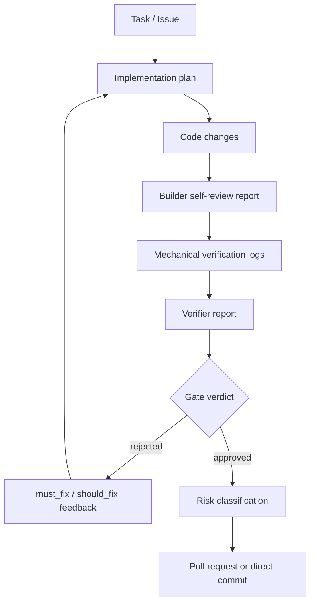

# Kaizen Agents Architecture Notes

These notes describe the intended workflow model behind Kaizen Agents. They are a design reference, not a production guarantee. The system is early-stage and the exact commands, policies, and schemas may change.

## System Model

Kaizen Agents is built around a simple separation:

- **`kaizen-loop` coordinates** task intake, workspace setup, loop control, verification calls, risk decisions, commits, and pull requests.
- **`builder-agent` builds** by understanding requirements, designing a solution, implementing changes, adding tests, and running self-review.
- **`verifier` verifies** by independently evaluating the result and producing a gate verdict.

## End-to-End Flow

The main loop starts from a GitHub Issue or task, creates an isolated workspace, delegates implementation, verifies the result, and then chooses whether to create a pull request, commit directly, or stop for human input.

## Builder-Centered Improvement Loop

This view focuses on the builder's feedback cycle. The builder receives a task, loops internally until self-review passes, then receives external feedback from mechanical verification and the independent verifier.

## Responsibility Boundaries

Each component has a narrow job. The builder can self-review, but the verifier remains independent and does not implement changes.

## Builder Internal Loop

The builder owns implementation quality before the external verification stages run.

Self-review should produce structured output, such as:

- `score`
- `must_fix`
- `should_fix`
- `confidence`
- notes on residual risk

This output is useful for improvement, but it is not the final gate.

## Gate Decision Model

The verifier evaluates the result after builder self-review and mechanical verification. It should not implement changes.

## Artifact Flow

Each loop should leave behind enough structured information to make the next decision observable.

## Final Quality Gate

The final quality gate is deliberately layered:

1. Builder self-review
2. Mechanical verification
3. Independent verifier review
4. Human review or repository policy

This prevents the builder from being the only judge of its own output while still using self-review as an improvement mechanism.

## Open Design Areas

- Exact verifier scoring schema
- Retry budget and stopping rules
- Direct-commit policy for low-risk changes
- Human escalation rules
- PR body format and review handoff
- Persistent logs and observability model
