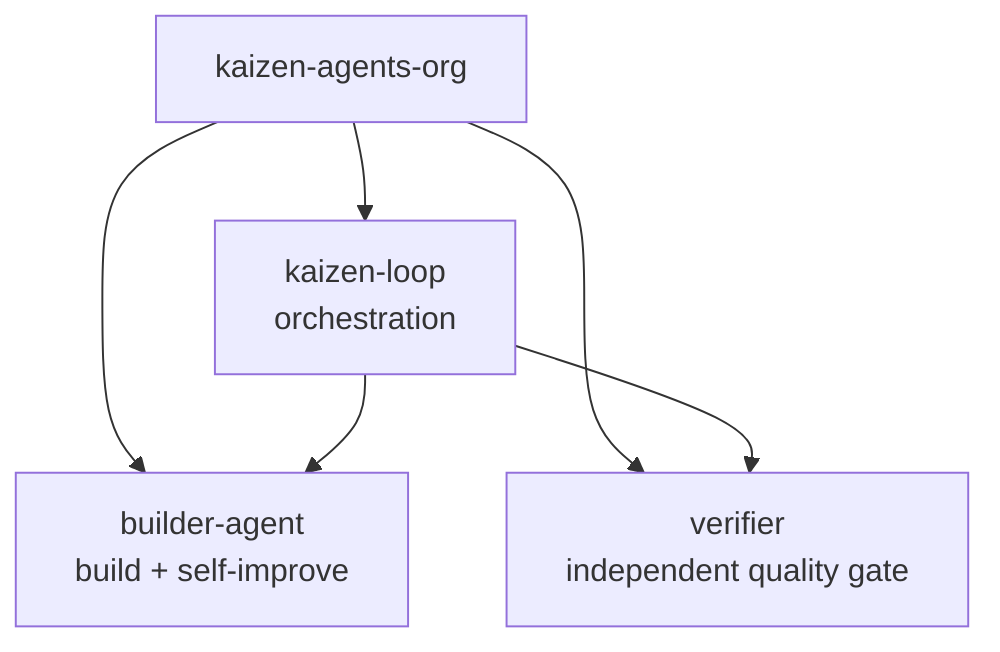
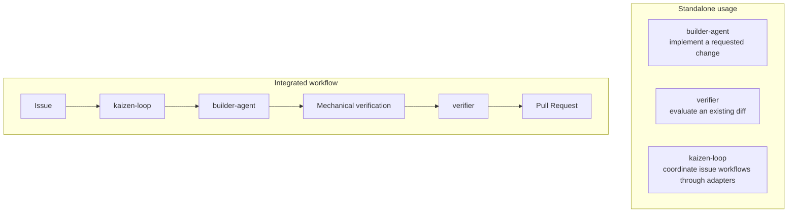
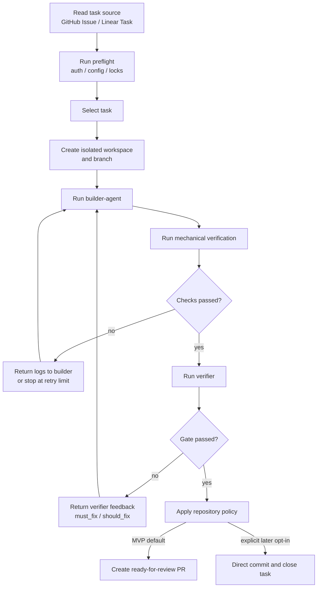
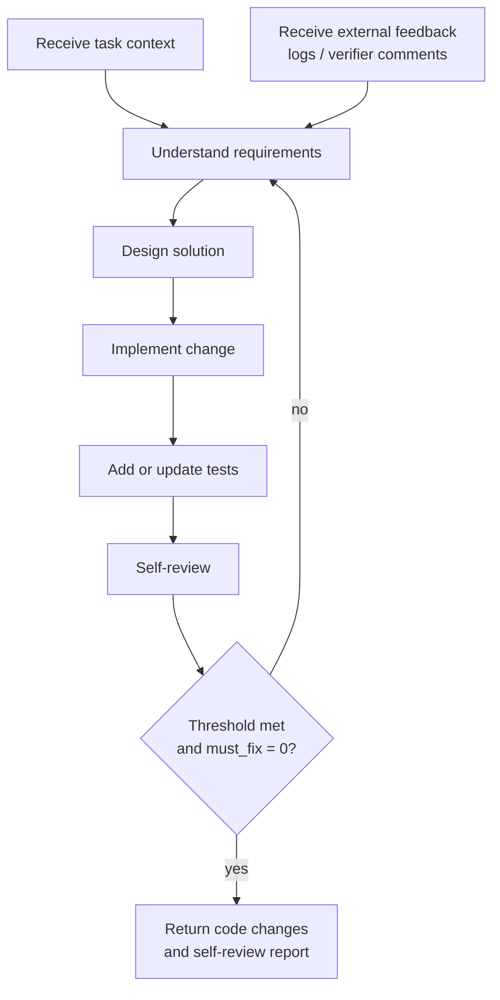
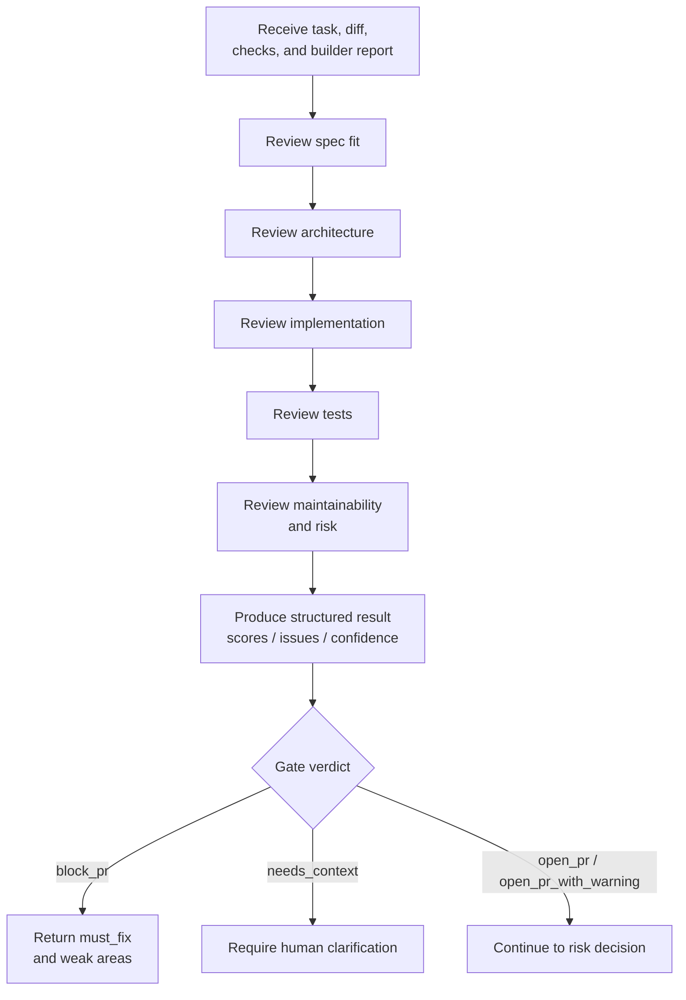
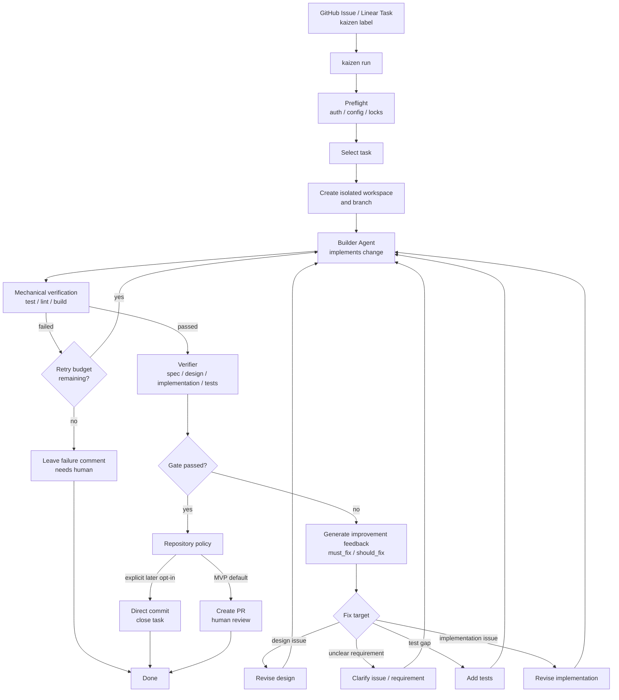
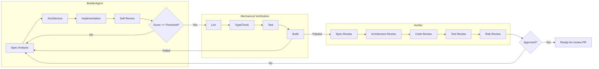
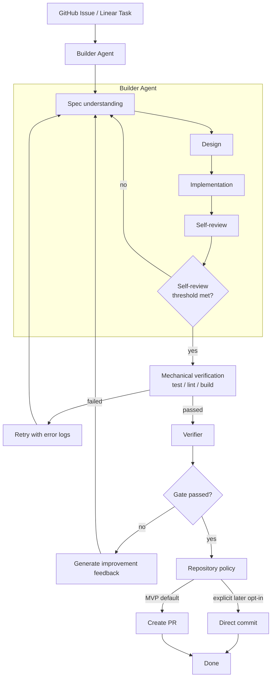
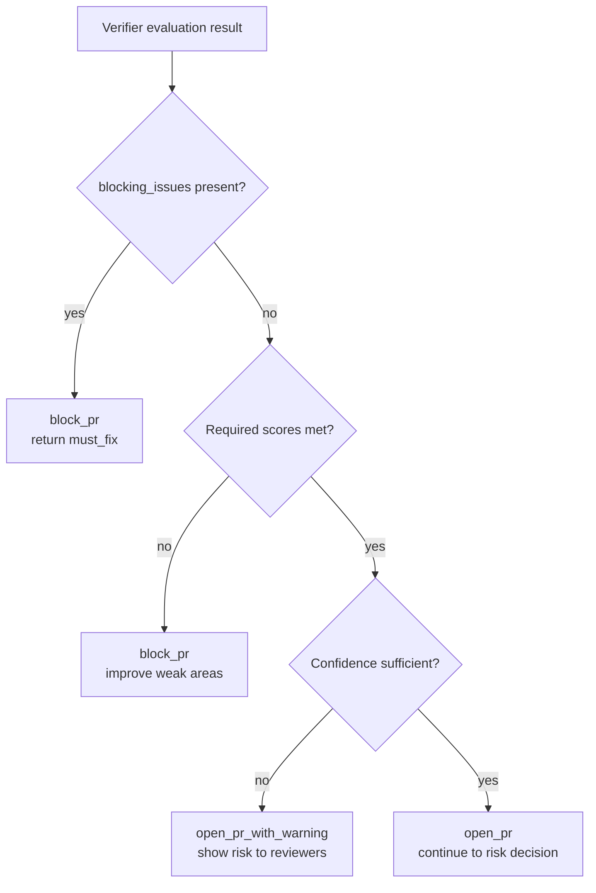
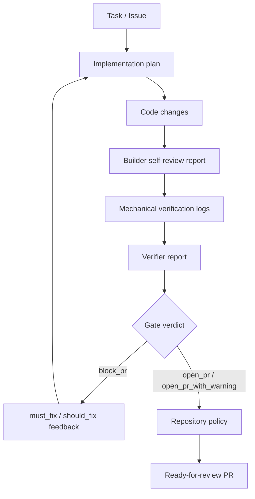

# Kaizen Agents Architecture Notes

These notes describe the intended workflow model behind Kaizen Agents. They are a design reference for an early-stage, experimental system, not a production guarantee.

The central principle is simple:

> Builders build. Verifiers verify. Kaizen Loop coordinates.

## Product Goal

The target user experience is:

1. A user registers an issue.
2. `kaizen-loop` selects the issue and creates an isolated workspace.
3. `builder-agent` produces a focused implementation.
4. Mechanical verification and `verifier` evaluate the result.
5. The system opens a high-quality pull request with enough context for review.
6. A human maintainer reviews and merges the PR.
7. The original issue is resolved by that merge.

The system optimizes for high-quality, reviewable PRs rather than unreviewed autonomy. Human merge remains the normal completion point for meaningful changes.

## Repository Map

| Repository | Primary responsibility | Does not own |
| --- | --- | --- |
| `kaizen-loop` | Orchestration, workspace lifecycle, loop control, policy decisions, branch pushes, and PR creation. | Implementing code changes or judging quality directly. |
| `builder-agent` | Requirement understanding, design, implementation, tests, and self-review. | Final approval. |
| `verifier` | Independent review, scoring, risk assessment, and gate verdicts. | Editing the implementation. |

## Standalone And Integrated Use

The three projects should compose into one workflow, but each should also remain useful by itself.

This means integration boundaries should be explicit. `kaizen-loop` can call the builder and verifier, but the builder and verifier should not require `kaizen-loop` to be valuable.

## Current MVP Snapshot

The architecture above is now partially implemented as a usable MVP slice. `kaizen-loop` Phase 2 support can coordinate builder-agent-based fixes, isolated per-issue worktrees, configured mechanical verification, verifier review, ready-for-review PR creation, scheduler registration, opt-in queueing, operational commands, and `pr-guardian` follow-up.

`builder-agent` is available as a standalone MVP CLI and Codex-compatible skill. `verifier` is available as a minimal runnable `verifier check` CLI and can write Kaizen Loop verdict payloads through `KAIZEN_VERIFIER_RESULT_PATH`.

The remaining gap is no longer "no runnable builder/verifier path." The gap is hardening the MVP contracts, improving artifacts and evidence quality, and expanding `verifier` from the minimal verdict gate toward the fuller staged review model described below.

## Component Process Flows

Each repository owns a different part of the loop. The system is easier to reason about when those processes are described independently.

### kaizen-loop

`kaizen-loop` is the coordinator. It does not implement code or make the verifier's quality judgment itself; it connects the task source, workspace, agents, checks, and repository policy.

### builder-agent

`builder-agent` owns implementation. It may self-review and improve its own output, but that self-review is an internal quality loop rather than the final gate.

### verifier

`verifier` evaluates the completed change independently. It should produce structured output that can drive the next loop, but it should not edit the implementation.

## End-to-End Workflow

The main workflow starts from an approved task and continues until the change is opened as a PR or handed back to a human. Direct commit is a later repository-level opt-in, not the MVP default.

## Responsibility Pipeline

This is the clearest view of the core responsibility boundary. The builder has an internal quality loop, mechanical verification catches objective failures, and the verifier makes an independent approval decision.

## Builder Improvement Loop

The builder is allowed to self-review and improve its own work before external verification. That self-review is useful for iteration, but it is not trusted as the final gate.

Structured self-review output should include enough information to drive the next loop:

- `score`
- `must_fix`
- `should_fix`
- `confidence`
- residual risk notes

## Gate Decision Model

The verifier runs after builder self-review and mechanical verification. It evaluates the completed change without editing it.

The MVP gate has four meaningful outcomes:

- **`open_pr`**: no blocking or warning signal was found; continue to ready-for-review PR creation.
- **`open_pr_with_warning`**: no blocking issue is known, but non-blocking risk should be shown to reviewers.
- **`block_pr`**: the builder must address `must_fix` items or weak scoring areas before PR creation.
- **`needs_context`**: task or diff context is insufficient; stop for human clarification.

## Artifact Flow

Every loop should leave behind enough structured information to make the next decision observable.

## Documentation And Issue Intake

The organization documentation is part of the coordination contract. Automated monitor issues and cross-repository follow-up work should be grounded in the closest relevant source:

1. Organization Profile for public product framing and current project status.
2. Repository README for shared assets and local repository responsibilities.
3. Architecture Notes for component boundaries, workflow shape, and quality gates.
4. Issue-to-PR MVP for target repository runtime contracts.
5. Project-local README/docs for repository-specific commands and behavior.

If those sources do not support a proposed issue, the correct output is a documentation drift report or clarification request, not a speculative implementation issue. When an issue is created, include a concise `Documentation basis` section with the cited document paths or URLs and the reason they apply.

## Final Quality Gate

The final quality gate is deliberately layered:

1. Builder self-review
2. Mechanical verification
3. Independent verifier review
4. Human review or repository policy

This prevents the builder from being the only judge of its own output while still using self-review as an improvement mechanism.

## Current Design Questions

- Exact verifier scoring schema
- Retry budget and stopping rules
- Later opt-in direct-commit policy for low-risk changes
- Human escalation rules
- PR body format and review handoff
- Persistent logs and observability model
