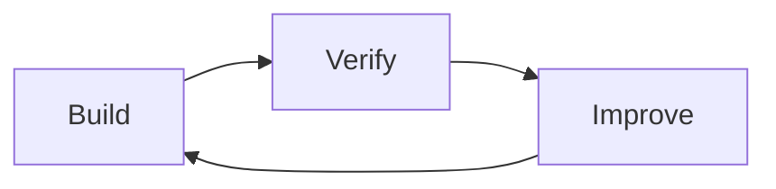
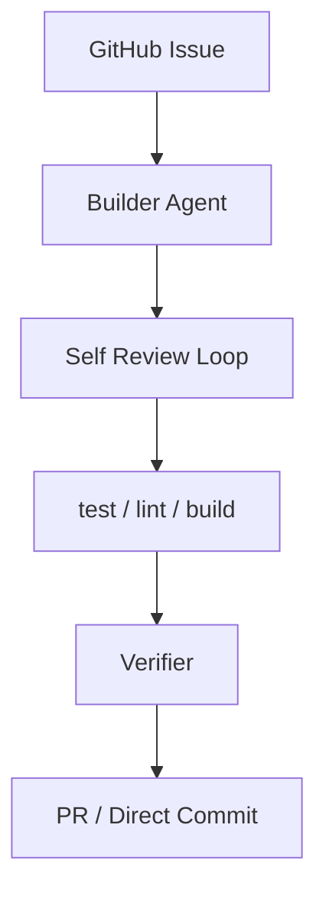
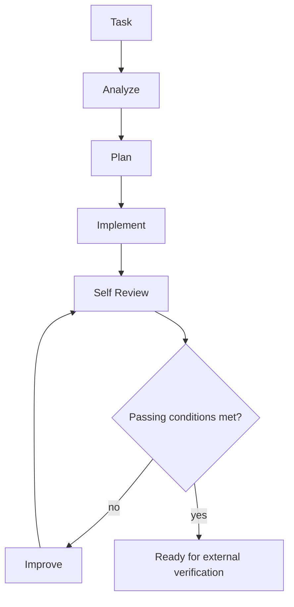

# Kaizen Agents Design Decisions

Date: 2026-06-15

This document records the design decisions that should guide implementation across `kaizen-loop`, `builder-agent`, and `verifier`.

## Product Goal

The system goal is:

> A user registers an issue. Kaizen Agents prepares a high-quality pull request that solves it. A human maintainer reviews and merges that PR, and the merge resolves the original issue.

The system is not designed to remove human ownership of the repository. It is designed to make the proposed solution more complete, verified, and reviewable before a maintainer sees it.

## Core Philosophy



The operating principle is:

> Builders build. Verifiers verify. Kaizen Loop coordinates.

Responsibilities must stay separated:

- `builder-agent` builds and improves the implementation.
- `verifier` independently evaluates the result.
- `kaizen-loop` coordinates the workflow.

## Standalone Project Principle

The three projects should work together, but they should not only work together. Each project should be useful as a standalone tool or skill:

- `builder-agent` should be usable to implement a requested change in a local workspace even when no `kaizen-loop` run is involved.
- `verifier` should be usable to evaluate an existing diff, PR, or local change even when the change was not produced by `builder-agent`.
- `kaizen-loop` should be usable as an orchestrator that can call the default builder and verifier, while keeping those integrations behind clear contracts.

This keeps the system easier to test, easier to replace component by component, and less likely to collapse into one tightly coupled automation script.

## Why Self-Review Is Not Enough

The builder should review its own output because self-review improves implementation quality before external checks run.

However, self-review must not be trusted as the final quality gate. If the same agent both creates and approves the work, it can eventually declare its own output acceptable even when important issues remain.

The final gate must therefore be layered:

1. Builder self-review
2. Mechanical verification
   - lint
   - typecheck
   - test
   - build
3. Independent verifier
4. Human review

## Deterministic Gates, LLM Discovery

Automation may use LLMs to find, summarize, and explain candidate issues, but review-critical gate decisions should be deterministic wherever a component contract can support that. When an existing automation is still prompt-only, its source prompt must use explicit documented checklists, record the evidence behind create/skip decisions, and treat that behavior as an interim step toward deterministic gates.

Default rule:

> Let code decide gates. Let LLMs discover evidence.

Use deterministic code for:

- verdict selection
- confidence or risk thresholds
- WIP limits and queue admission
- duplicate suppression decisions
- retry, escalation, and stop conditions
- PR readiness labels or status fields

For source-managed automations such as scout, monitor, and readiness issue creation, do not infer from this principle that the current prompts are allowed to skip backlog guards or duplicate checks. Until those checks move behind deterministic code, the prompt itself is the auditable contract and must spell out the required checks and evidence.

Use LLMs for:

- extracting claims from noisy logs, diffs, or issue text
- finding likely implementation or test risks
- explaining why a deterministic gate failed
- proposing follow-up work for human or automated review

This keeps review-critical behavior reproducible while still using LLMs where flexible interpretation is useful. If a component needs a new autonomous judgment, first decide whether that judgment belongs in deterministic code or in LLM-produced evidence that a deterministic gate consumes.

## Main Architecture



The normal target path is PR creation followed by human merge. Direct commit is a policy-controlled option for low-risk work, not the default product goal.

## builder-agent

`builder-agent` is responsible for implementation.

Responsibilities:

- understand the specification
- design the solution
- implement the change
- add or update tests
- self-review the result
- improve the implementation based on its own review or external feedback

Non-responsibilities:

- creating pull requests
- GitHub issue management
- final approval
- release or merge risk decisions

### Builder Loop



### Builder Output

The builder should emit structured self-review output similar to:

```json
{
  "score": 86,
  "confidence": 0.72,
  "mustFix": [],
  "shouldFix": [],
  "niceToHave": [],
  "passed": true
}
```

Evaluation areas:

- `requirement_fit`
- `architecture_quality`
- `implementation_quality`
- `test_quality`
- `maintainability`

Default passing conditions:

- `score >= threshold`
- `mustFix.length === 0`
- `confidence >= 0.7`

### Skill And CLI

The MVP includes both a Codex-compatible skill and a small CLI.

Reason:

> The core of Builder Agent is a working method, but `kaizen-loop` also needs a stable executable contract.

The skill remains useful for local agent work, while the CLI provides a structured integration boundary:

```text
builder-agent/
|- SKILL.md
|- src/
|- schemas/
`- prompts/
```

The CLI is an MVP contract, not final approval.

## verifier

`verifier` is an independent evaluator.

Important rule:

> Do not trust the builder's self-review as final approval.

Verifier review areas:

- Spec Review
- Architecture Review
- Implementation Review
- Test Review
- Risk Review

Expected output shape:

```json
{
  "verdict": "open_pr_with_warning",
  "must_fix": [],
  "should_fix": [],
  "confidence": 82,
  "risk": "medium"
}
```

The current MVP verifier status vocabulary is `open_pr`, `open_pr_with_warning`, `block_pr`, and `needs_context`. The verifier should produce a gate result and feedback. It should not modify the implementation.

## kaizen-loop

`kaizen-loop` is the orchestrator.

Responsibilities:

- fetch or select issues
- create isolated workspaces
- invoke `builder-agent`
- run mechanical verification
- invoke `verifier`
- create pull requests
- manage retry and feedback loops

Non-responsibilities:

- implementing the code change
- making independent code-quality judgments itself

## Generated PRs And Conversation Resolution

Generated PRs must remain normal ready-for-review pull requests that pass the same branch protection as human-authored PRs.

For repositories that use `required_conversation_resolution: true`, a generated PR can report all required checks as successful and still have `mergeStateStatus: BLOCKED` when a review thread remains unresolved. This is expected behavior, not a branch protection failure. Review bot threads from CodeRabbit, Codex connector, or similar systems are part of the review gate until they are answered and resolved.

Responsibility follows the normal ownership split:

- `builder-agent` should address actionable implementation feedback when Kaizen Loop reruns the builder for a generated PR.
- `kaizen-loop` should detect unresolved review threads during PR follow-up and either rerun the builder for actionable bot feedback or escalate with clear evidence when the thread needs human judgment.
- Human maintainers decide whether non-actionable or policy-level bot comments can be resolved, and they remain responsible for the final merge.

The default timing is: after required checks pass, inspect unresolved review threads before treating a generated PR as merge-ready. If a bot thread identifies a real defect, rerun or repair the generated PR. If the thread is false positive, obsolete, or a product-policy judgment, record that decision in the PR conversation before a human resolves it.

The organization default should be consistent across `kaizen-loop`, `builder-agent`, `verifier`, and `.github`: required status checks plus required conversation resolution for protected main branches. Exceptions should be explicit design decisions with a repository-specific reason. Periodic branch-protection audits should treat a missing `required_conversation_resolution` setting as configuration drift unless an exception is documented.

## Product Kaizen Skill Is Out of Scope For Now

The Product Kaizen Skill is useful, but it belongs to a different layer.

Product Kaizen answers:

> What should we build or improve?

The current system answers:

> How do we build a requested change with higher quality?

Therefore Product Kaizen should not be included in the first `builder-agent` / `verifier` / `kaizen-loop` implementation. It can be added later as an upstream discovery and prioritization layer.

## Implementation Priority

Build in this order:

1. Harden `kaizen-loop` integration with the shipped `builder-agent` and `verifier` MVP CLIs.
2. Improve builder artifacts and verifier feedback quality.
3. Expand the verifier toward staged review.
4. Strengthen PR guardian and CI follow-up behavior.
5. Product Kaizen Skill.

The first usable milestone is a vertical slice:

1. A GitHub Issue is registered.
2. `builder-agent` produces an implementation.
3. Mechanical verification runs.
4. `verifier` evaluates the result.
5. `kaizen-loop` opens a PR.
6. A human reviews and merges the PR.
