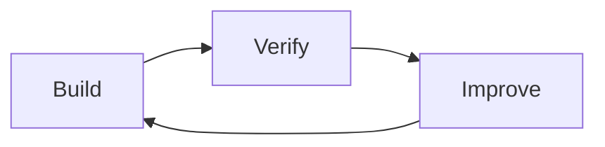
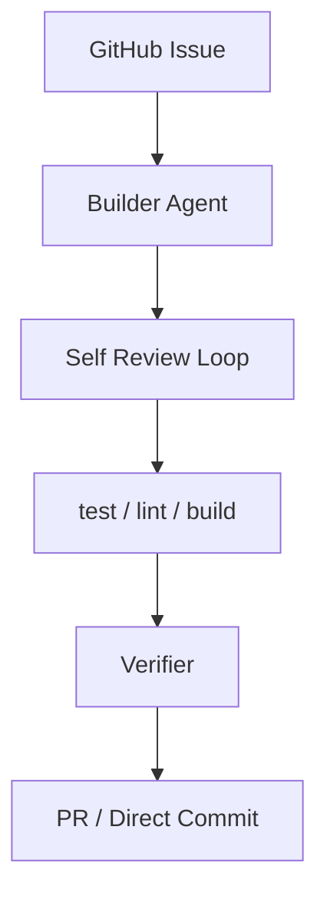
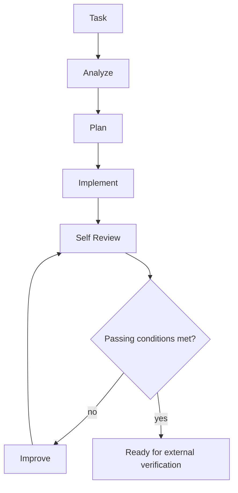

# Kaizen Agents Design Decisions

Date: 2026-06-13

This document records the design decisions that should guide implementation across `kaizen-loop`, `builder-agent`, and `verifier`.

## Product Goal

The system goal is:

> A user registers an issue. Kaizen Agents prepares a high-quality pull request that solves it. A human maintainer reviews and merges that PR, and the merge resolves the original issue.

The system is not designed to remove human ownership of the repository. It is designed to make the proposed solution more complete, verified, and reviewable before a maintainer sees it.

## Core Philosophy



The operating principle is:

> Builders build. Verifiers verify. Kaizen Loop coordinates.

Responsibilities must stay separated:

- `builder-agent` builds and improves the implementation.
- `verifier` independently evaluates the result.
- `kaizen-loop` coordinates the workflow.

## Why Self-Review Is Not Enough

The builder should review its own output because self-review improves implementation quality before external checks run.

However, self-review must not be trusted as the final quality gate. If the same agent both creates and approves the work, it can eventually declare its own output acceptable even when important issues remain.

The final gate must therefore be layered:

1. Builder self-review
2. Mechanical verification
   - lint
   - typecheck
   - test
   - build
3. Independent verifier
4. Human review

## Main Architecture



The normal target path is PR creation followed by human merge. Direct commit is a policy-controlled option for low-risk work, not the default product goal.

## builder-agent

`builder-agent` is responsible for implementation.

Responsibilities:

- understand the specification
- design the solution
- implement the change
- add or update tests
- self-review the result
- improve the implementation based on its own review or external feedback

Non-responsibilities:

- creating pull requests
- GitHub issue management
- final approval
- release or merge risk decisions

### Builder Loop



### Builder Output

The builder should emit structured self-review output similar to:

```json
{
  "score": 86,
  "confidence": 0.72,
  "mustFix": [],
  "shouldFix": [],
  "niceToHave": [],
  "passed": true
}
```

Evaluation areas:

- `requirement_fit`
- `architecture_quality`
- `implementation_quality`
- `test_quality`
- `maintainability`

Default passing conditions:

- `score >= threshold`
- `mustFix.length === 0`
- `confidence >= 0.7`

### Skill Before CLI

The first implementation of `builder-agent` should be a Codex-compatible skill, not a CLI.

Reason:

> The core of Builder Agent is a working method, not a command-line interface.

Start with:

```text
builder-agent/
|- SKILL.md
`- prompts/
   |- implement.md
   |- self-review.md
   `- improve.md
```

A CLI can be added after the behavior, prompts, schemas, and loop are proven.

## verifier

`verifier` is an independent evaluator.

Important rule:

> Do not trust the builder's self-review as final approval.

Verifier review areas:

- Spec Review
- Architecture Review
- Implementation Review
- Test Review
- Risk Review

Expected output shape:

```json
{
  "approved": false,
  "score": 82,
  "must_fix": [],
  "should_fix": [],
  "risk": "medium"
}
```

The verifier should produce a gate result and feedback. It should not modify the implementation.

## kaizen-loop

`kaizen-loop` is the orchestrator.

Responsibilities:

- fetch or select issues
- create isolated workspaces
- invoke `builder-agent`
- run mechanical verification
- invoke `verifier`
- create pull requests
- manage retry and feedback loops

Non-responsibilities:

- implementing the code change
- making independent code-quality judgments itself

## Product Kaizen Skill Is Out of Scope For Now

The Product Kaizen Skill is useful, but it belongs to a different layer.

Product Kaizen answers:

> What should we build or improve?

The current system answers:

> How do we build a requested change with higher quality?

Therefore Product Kaizen should not be included in the first `builder-agent` / `verifier` / `kaizen-loop` implementation. It can be added later as an upstream discovery and prioritization layer.

## Implementation Priority

Build in this order:

1. `builder-agent` Skill
2. `verifier` Skill
3. `kaizen-loop` integration
4. Builder Agent CLI
5. Product Kaizen Skill

The first usable milestone is a vertical slice:

1. A GitHub Issue is registered.
2. `builder-agent` produces an implementation.
3. Mechanical verification runs.
4. `verifier` evaluates the result.
5. `kaizen-loop` opens a PR.
6. A human reviews and merges the PR.
