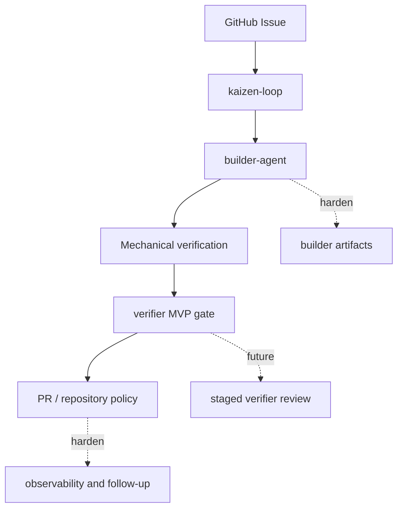

# Implementation Status

Date: 2026-06-17

This document tracks how close the current implementation is to the intended Kaizen Agents flow.

## Target Flow

```text
GitHub Issue
  -> kaizen-loop
  -> builder-agent
  -> mechanical verification
  -> verifier
  -> pull request
  -> human merge
```

The intended product outcome is a high-quality PR that a human maintainer can review and merge to resolve the original issue.

## Summary

The first usable target flow is now wired together, but it is still an MVP. The current work is about hardening contracts, improving evidence quality, and expanding the verifier beyond the minimal verdict CLI.

| Component | Current state | What works | Main gap |
| --- | --- | --- | --- |
| `kaizen-loop` | Phase 2 TypeScript CLI exists. | Issue selection, isolated per-issue worktrees, builder-agent-based fixes, configured verification, verifier review, scheduler registration, opt-in queueing, PR creation, `pr-guardian` follow-up, and operational commands. | Continue hardening retry behavior, observability, and final contract edges. |
| `builder-agent` | MVP CLI and Codex skill are shipped on `main`. | Adapter-based `analyze -> plan -> implement -> selfReview -> improve` loop, schemas, CLI, tests, and Kaizen integration payloads. | Continue improving adapter behavior and the quality of artifacts consumed by `kaizen-loop` and `verifier`. |
| `verifier` | MVP `verifier check` CLI is shipped on `main`. | Kaizen integration payloads with `open_pr`, `open_pr_with_warning`, `block_pr`, and `needs_context`. | The fuller staged verifier from the design docs is future work. |

## Current Capabilities

### kaizen-loop

Implemented capabilities include:

- GitHub Issue selection by label
- isolated per-issue workspace and branch setup
- builder-agent-based fixes through the integration contract
- Claude/Codex agent execution through configured adapters
- baseline verification
- verification retry loop
- configured `lint` / `typecheck` / `test` / `build` command execution
- verifier review
- scheduler registration
- PR creation
- `pr-guardian` follow-up after PR creation
- opt-in issue queueing with `kaizen:ready`
- policy-based direct commit decision logic
- operational commands such as `doctor`, `status`, `logs`, and `report`

Current limitation:

- The builder and verifier contracts are MVP contracts and still need hardening.
- The verifier step is a minimal verdict gate, not the full staged verifier described in the product design.
- `kaizen watch` remains a later-phase capability.

### builder-agent

Implemented capabilities include:

- standalone `builder-agent` CLI
- Codex-compatible builder skill
- adapter-based implementation loop
- structured build request normalization
- structured self-review normalization
- structured build result artifacts
- passing tests for the loop controller and CLI
- Kaizen integration mode that writes the result contract expected by `kaizen-loop`

Current limitation:

- It depends on an adapter to perform actual implementation work.
- Its artifacts and discovered-issue reports still need more production mileage across repositories.

### verifier

Implemented capabilities include:

- runnable `verifier check` CLI
- minimal JSON verdict output
- Kaizen integration mode through `KAIZEN_VERIFIER_RESULT_PATH`
- current status vocabulary: `open_pr`, `open_pr_with_warning`, `block_pr`, and `needs_context`
- product/spec documentation, design documentation, and evaluation harness specification

Current limitation:

- The shipped verifier intentionally does not implement the full staged verifier from `docs/`.
- Advanced review stages, probes, and richer scoring remain future work.

## What Still Needs Hardening

The main missing pieces are no longer the builder/verifier executables. The remaining work is contract depth, evidence quality, and operational maturity.



The system can now run:

```text
Issue -> builder-agent -> mechanical verification -> verifier MVP -> PR
```

It still needs more work before claiming:

```text
Issue -> high-confidence staged verifier review -> mature feedback loops -> consistently high-quality PR
```

## Minimum Work To Harden The Vertical Slice

1. Keep the `builder-agent` and `verifier` CLI contracts stable across `kaizen-loop` releases.
2. Improve builder artifacts consumed by the verifier:
   - task understanding
   - changed files
   - self-review report
   - residual risk
3. Expand verifier behavior beyond the minimal MVP gate:
   - input: task, diff, verification logs, builder report
   - output status: `open_pr`, `open_pr_with_warning`, `block_pr`, or `needs_context`
   - include `must_fix`, `should_fix`, `confidence`, and `risk`
4. Route `block_pr` feedback back to the builder loop until retry budget is exhausted.
5. Route `needs_context` to a human clarification path.
6. Keep the default integrated mode PR-first and ready-for-review.
7. Run repeated end-to-end smoke tests on small issues across the core repositories.

## First Acceptance Test

The first acceptance test should prove this path:

1. Create a small issue in a test repository.
2. Run `kaizen run --issue <number>`.
3. Confirm `builder-agent` produces a build result and self-review report.
4. Confirm mechanical verification runs.
5. Confirm `verifier` returns a gate verdict.
6. Confirm `kaizen-loop` creates a PR.
7. Confirm the PR body includes:
   - original issue
   - builder summary
   - verification results
   - verifier verdict
   - known risk

The first successful version does not need direct commit support. PR creation and human merge are the product goal.
