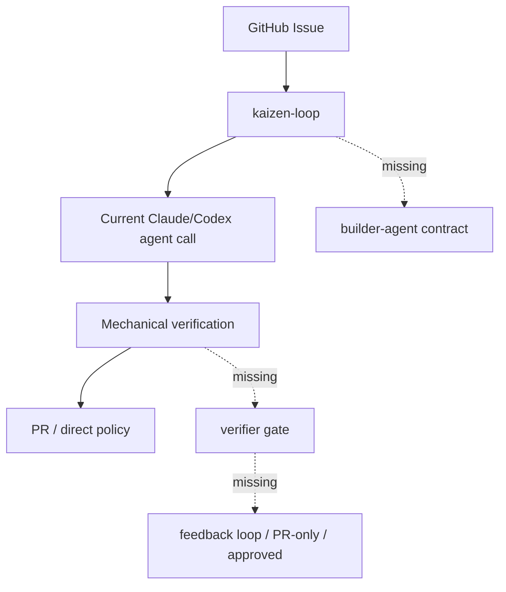

# Implementation Status

Date: 2026-06-13

This document tracks how close the current implementation is to the intended Kaizen Agents flow.

## Target Flow

```text
GitHub Issue
  -> kaizen-loop
  -> builder-agent
  -> mechanical verification
  -> verifier
  -> pull request
  -> human merge
```

The intended product outcome is a high-quality PR that a human maintainer can review and merge to resolve the original issue.

## Summary

The target flow is not complete yet.

The current repositories contain useful pieces, but the full `Issue -> builder -> checks -> verifier -> PR` path is not wired together.

| Component | Current state | What works | Main gap |
| --- | --- | --- | --- |
| `kaizen-loop` | TypeScript CLI foundation exists. | Issue selection, workspaces, agent execution, configured verification, PR/direct-commit policy pieces. | It does not yet call `builder-agent` or `verifier` through the intended contracts. |
| `builder-agent` | MVP loop controller exists on a feature branch. | Adapter-based `analyze -> plan -> implement -> selfReview -> improve` loop, schemas, CLI, tests. | It is not yet integrated into `kaizen-loop` as the build phase. |
| `verifier` | Specs and design documents exist. | Detailed verifier product/spec/eval design. | No executable verifier package or minimal gate CLI exists yet. |

## Current Capabilities

### kaizen-loop

Implemented capabilities include:

- GitHub Issue selection by label
- isolated workspace and branch setup
- Claude/Codex agent execution
- baseline verification
- verification retry loop
- configured `lint` / `typecheck` / `test` / `build` command execution
- PR creation
- policy-based direct commit decision logic
- operational commands such as `doctor`, `status`, `logs`, and `report`

Current limitation:

- The implementation agent is invoked directly through Claude/Codex adapters.
- There is no `builder-agent` contract boundary in the main run loop yet.
- There is no independent verifier step after mechanical verification.

### builder-agent

Implemented capabilities include:

- standalone `builder-agent` CLI
- adapter-based implementation loop
- structured build request normalization
- structured self-review normalization
- structured build result artifacts
- passing tests for the loop controller and CLI

Current limitation:

- It depends on an adapter to perform actual implementation work.
- It is not yet called by `kaizen-loop`.
- Its self-review artifacts are not yet consumed by `kaizen-loop` or `verifier`.

### verifier

Available assets include:

- product/spec documentation
- design documentation
- evaluation harness specification
- intended verdict model

Current limitation:

- There is no runnable `verifier check` command yet.
- There is no minimal JSON verdict implementation yet.
- `kaizen-loop` cannot call the verifier because no executable contract exists.

## Why The Full Flow Does Not Work Yet

The missing pieces are integration and the verifier runtime.



The system can already approximate:

```text
Issue -> agent fix -> mechanical verification -> PR
```

It cannot yet guarantee:

```text
Issue -> builder self-review loop -> mechanical verification -> independent verifier -> high-quality PR
```

## Minimum Work To Complete The First Vertical Slice

1. Stabilize and merge `builder-agent` MVP.
2. Define the `kaizen-loop` build-phase contract:
   - input: issue/task, repository context, constraints, threshold
   - output: build result, self-review report, changed files
3. Add a `builder-agent` adapter to `kaizen-loop`.
4. Create a minimal verifier executable:
   - input: task, diff, verification logs, builder report
   - output: `approved`, `rejected`, or `pr_only`
   - include `must_fix`, `should_fix`, `confidence`, and `risk`
5. Add a verifier step to `kaizen-loop` after mechanical verification.
6. Route verifier rejection back to the builder loop.
7. Make the initial integrated mode PR-only.
8. Run one end-to-end smoke test on a small issue.

## First Acceptance Test

The first acceptance test should prove this path:

1. Create a small issue in a test repository.
2. Run `kaizen run --issue <number>`.
3. Confirm `builder-agent` produces a build result and self-review report.
4. Confirm mechanical verification runs.
5. Confirm `verifier` returns a gate verdict.
6. Confirm `kaizen-loop` creates a PR.
7. Confirm the PR body includes:
   - original issue
   - builder summary
   - verification results
   - verifier verdict
   - known risk

The first successful version does not need direct commit support. PR creation and human merge are the product goal.
