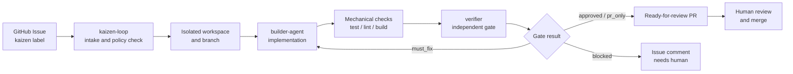

# Issue-to-PR MVP

This document defines the organization-level MVP for making Kaizen Agents useful across the core projects.

The target experience is:

> Register an issue, let the system work on it, and get a ready-for-review pull request.

The MVP does not fully automate merging. Human review and merge remain the final control point.

## Scope

The MVP connects three systems:

| System | Responsibility |
| --- | --- |
| `kaizen-loop` | Selects issues, creates isolated workspaces and branches, runs gates, comments on issues, and creates PRs. |
| `builder-agent` | Understands the task, implements the change, adds or updates tests, and self-reviews. |
| `verifier` | Independently reviews the completed diff and returns a gate decision. |

Each system should be usable on its own, but the first integrated milestone is the end-to-end path from one GitHub Issue to one pull request.

## MVP Success Criteria

An MVP run is successful when:

1. A GitHub Issue is created with the agreed trigger label.
2. `kaizen-loop` selects the issue and creates an isolated branch.
3. `builder-agent` produces a focused implementation.
4. Mechanical checks run through the target repository's configured commands.
5. `verifier` returns a structured gate result.
6. `kaizen-loop` creates a normal ready-for-review PR.
7. The issue receives a comment linking to the PR and summarizing verification.
8. A human reviewer can merge or request changes.

PRs are regular ready-for-review PRs by default. Do not create draft PRs and do not pass `--draft` to `gh pr create` unless a user explicitly asks for a draft.

Every implementation PR must target the repository's default branch and link its source issue in the PR body with a GitHub closing keyword such as `Closes #42`. A PR title containing `#42` or an issue comment saying "Implemented in ..." is not enough.

## Non-Goals

- Automatic merge.
- Unreviewed direct pushes to the default branch.
- Guessing through unclear requirements.
- Large feature work without a clear issue contract.
- Human-sensitive changes without approval, including secrets, authentication, billing, destructive database changes, and production infrastructure changes.

If the issue is not actionable, the system should comment with the missing information and stop instead of manufacturing a solution.

## Repository Contract

Each target repository should contain a small contract that tells the shared system how to operate there. The goal is not to copy the whole system into every repository; the goal is to make each repository ready to receive issue-driven PRs.

Recommended files:

```text
AGENTS.md
.kaizen/
  config.yml
.github/
  ISSUE_TEMPLATE/
    kaizen.yml
```

### `AGENTS.md`

`AGENTS.md` should describe repository-specific working rules:

- What commands to run before opening a PR.
- Which files or areas are high-risk.
- Which changes require human confirmation.
- Whether the repository has special branch, commit, or PR conventions.
- That PRs should be ready-for-review by default, not draft.

### `.kaizen/config.yml`

`.kaizen/config.yml` should contain machine-readable orchestration settings:

```yaml
version: 1

agent:
  default: codex
  fallback: true

commands:
  setup: "npm ci"
  verify:
    - "npm test"
    - "npm run lint"

policy:
  mode: pr-only
  protectedPaths:
    - ".github/**"
    - "**/.env*"
    - "**/secrets/**"
    - "**/*migration*/**"
    - ".kaizen/**"

issues:
  label: "kaizen"
```

The commands should be adapted per repository. For example, a TypeScript repo may use `npm run typecheck`; a Rust repo may use `cargo test`.

For the MVP, `policy.mode: pr-only` is the default posture. Hybrid or direct-commit behavior can be evaluated later per repository.

## End-to-End Flow



## PR Requirements

Every generated PR should include:

- The linked issue, using `Closes #<issue-number>` for same-repository issues or `Closes owner/repo#<issue-number>` for cross-repository issues.
- A concise summary of the change.
- Verification commands and results.
- The verifier result.
- Known residual risks or follow-up notes.

Example:

```markdown
## Summary
- Fixed config reload so stale values are cleared before applying new values.
- Added regression coverage for reload behavior.

## Verification
- `npm test`
- `npm run lint`

## Gate
- verifier: approved
- risk: low

Closes #42
```

After PR creation, the workflow should verify that GitHub recognized the issue link:

```sh
gh pr view <number> --json baseRefName,closingIssuesReferences,isDraft,url
```

`baseRefName` must be the repository's default branch and `closingIssuesReferences` must include the intended issue before the PR is considered ready. GitHub only applies closing keywords automatically when the PR targets the default branch.

## Failure Behavior

When the system cannot produce a reviewable PR, it should leave a useful issue comment and stop.

| Failure | Expected behavior |
| --- | --- |
| Requirement is unclear | Ask for the missing information and mark the issue as needing human input. |
| Checks fail after retry budget | Comment with the failed commands and relevant log summary. |
| Verifier rejects the change | Feed `must_fix` back to the builder until retry budget is exhausted. |
| Forbidden path changed | Discard the change and report the policy violation. |
| High-risk change requires approval | Stop and ask for explicit human confirmation. |

## Phase Plan

### MVP v1

- One trigger label: `kaizen`.
- One issue produces one branch and one PR.
- `builder-agent` can run manually or through the initial adapter.
- Mechanical verification is required before PR creation.
- `verifier` returns a structured result.
- Failure cases comment on the issue.

### MVP v2

- PR review comment handling.
- CI failure follow-up.
- Better retry and feedback loops between verifier and builder.
- Cross-repository suggestions when the same issue pattern appears elsewhere.

### Later

- Optional hybrid reflection for repositories that explicitly opt in.
- More task sources beyond GitHub Issues.
- Product Kaizen for deciding what issues to create, after the Issue-to-PR path is stable.

## Operating Principle

The system should feel automatic up to PR creation and conservative at the point of merge.

That gives the useful product behavior, "I filed an issue and a PR appeared," without removing human judgment from the final integration decision.
