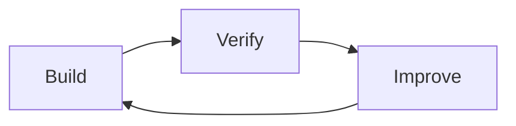
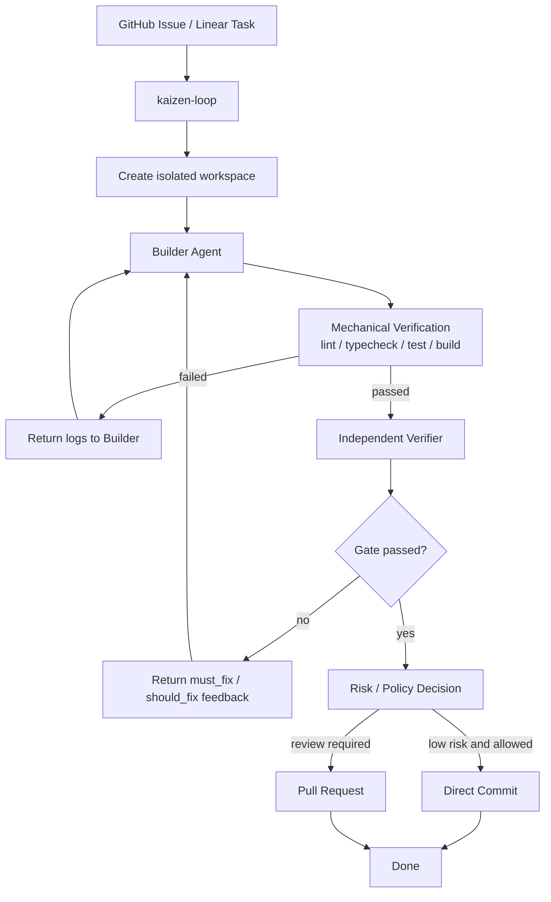
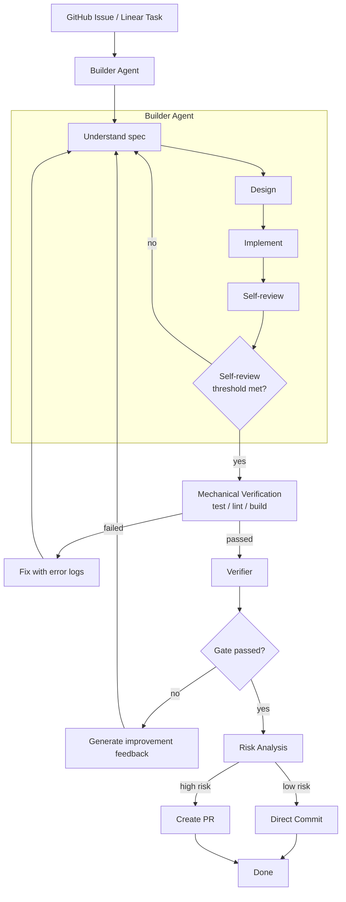
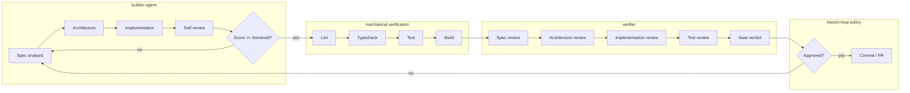
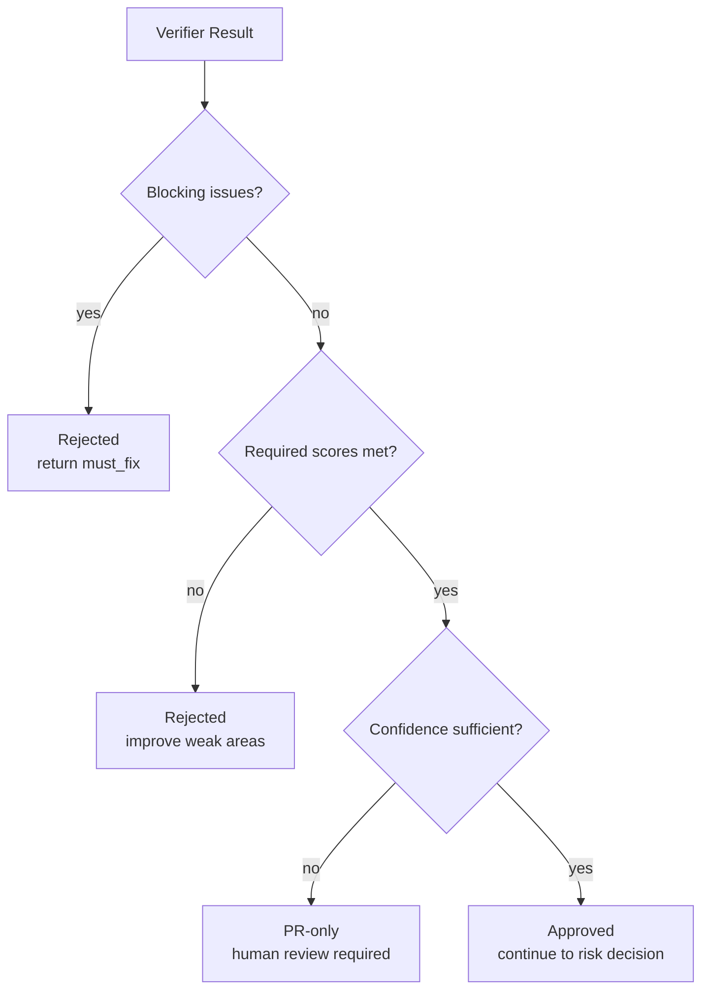

# Kaizen Agents

Experimental autonomous software development workflows built around **Build -> Verify -> Improve**.

Kaizen Agents is an early-stage organization for exploring continuous improvement loops in software development. The system separates implementation, verification, and orchestration into independent components so each responsibility can evolve without blurring the quality gate.

This work is experimental and in progress. Interfaces, policies, and repository boundaries may change as the workflow matures.

## Core Idea

- **Build**: a builder agent implements an approved task in an isolated workspace.
- **Verify**: mechanical checks and an independent verifier evaluate the output.
- **Improve**: feedback loops back into the builder until the change is acceptable or needs human input.

## Core Repositories

| Repository | Responsibility | Status |
| --- | --- | --- |
| `kaizen-loop` | Orchestrates issues, workspaces, agents, verification, risk decisions, commits, and pull requests. | Early-stage |
| `builder-agent` | Implements approved tasks and runs an internal self-review loop before external verification. | Experimental |
| `verifier` | Independently evaluates spec fit, architecture, implementation, tests, maintainability, and risk. | Work in progress |

## Workflow

## Builder Improvement Loop

## Responsibility Separation

Builders build. Verifiers verify. Kaizen Loop coordinates.

Builder self-review is useful, but it is not trusted as the final quality gate. The final gate combines:

1. Builder self-review
2. Mechanical verification
3. Independent verifier review
4. Human review or repository policy

## Gate Decision Model

## Design Principles

- Separate implementation from evaluation.
- Treat self-review as useful but insufficient.
- Prefer objective verification where possible.
- Keep approval gates explicit.
- Preserve user changes.
- Keep implementation scope constrained.
- Make every loop observable.

## Current Status

Kaizen Agents is early-stage, experimental, and actively changing. The current focus is defining the responsibility boundaries and feedback loops before treating the system as production-ready automation.

## Planned Direction

- `builder-agent` skill and CLI workflows
- `verifier` CLI and structured gate reports
- `kaizen-loop` orchestration over GitHub Issues
- Isolated workspace and branch management
- PR creation and merge-readiness workflows
- Policy-based low-risk direct commits

For deeper workflow details, see [Architecture Notes](https://github.com/kaizen-agents-org/.github/blob/main/docs/architecture.md).
