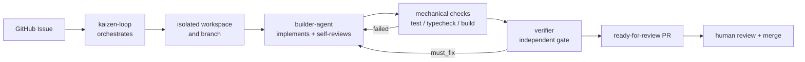
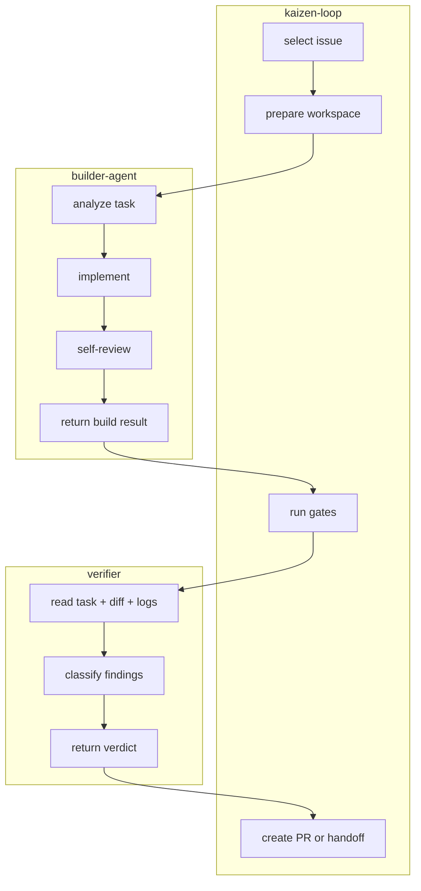

# Kaizen Agents

Kaizen Agents turns GitHub Issues into high-quality, reviewable pull requests.

The system is intentionally conservative: automation can build, verify, and open a PR, but human maintainers still own merge decisions.

## Issue-To-PR Flow

The system is built around three responsibilities:

> Builders build. Verifiers verify. Kaizen Loop coordinates.

## Core Projects

| Project | What it is | Standalone use | Current status |
| --- | --- | --- | --- |
| `kaizen-loop` | Orchestrator for issue intake, workspaces, checks, verifier calls, policy, and PR creation. | Coordinate GitHub Issue workflows through repository config. | TypeScript CLI with run, fix, report, queue, improve, scheduler, doctor, logs, builder integration, verifier integration, and PR guardian hooks. |
| `builder-agent` | Implementation worker with an internal self-review and improvement loop. | Implement a requested change in a local workspace and produce structured build artifacts. | MVP CLI, schema-backed artifacts, Codex/Claude provider fallback, and Kaizen Loop integration payload. |
| `verifier` | Independent evaluator for completed changes. | Evaluate task, diff, verification logs, and builder report, then return a gate verdict. | MVP CLI returns `open_pr`, `open_pr_with_warning`, `block_pr`, or `needs_context`; staged verifier design remains roadmap. |
| `coderabbit` | Shared CodeRabbit review configuration. | Provides organization-level PR review defaults. | Active YAML config and setup docs. |
| `renovate-config` | Shared Renovate dependency update defaults. | Provides conservative dependency PR policy. | Active `default.json` preset and setup docs. |

Each project should be useful on its own. The integrated system should compose them through explicit contracts rather than turning them into one inseparable automation script.

## Responsibility Model

Builder self-review improves the work, but it is not the final gate. The final quality gate is layered:

1. Builder self-review
2. Mechanical verification
3. Independent verifier review
4. Human review

## Current Reality

The first usable vertical slice exists, but the product is still early and the contracts are still being hardened.

- `kaizen-loop` can process issues, create isolated per-issue worktrees, run builder-agent-based fixes, run configured verification commands, call verifier review, create PRs, and follow up with the vendored `pr-guardian` skill.
- `builder-agent` has a standalone MVP CLI, a Codex-compatible skill, schema-backed artifacts, and a loop controller for implementation plus self-review.
- `verifier` has a runnable MVP CLI that returns `open_pr`, `open_pr_with_warning`, `block_pr`, or `needs_context`.
- The richer staged verifier described in the design docs remains future work; the shipped verifier is the minimal verdict CLI needed for orchestration.

The current practical milestone is hardening this path:

> GitHub Issue -> builder-agent -> mechanical verification -> verifier -> ready-for-review pull request.

## Documentation

Start here:

- [Docs Index](https://github.com/kaizen-agents-org/.github/blob/main/docs/README.md): map of the documentation set.
- [Architecture Notes](https://github.com/kaizen-agents-org/.github/blob/main/docs/architecture.md): system responsibilities and flow diagrams.
- [MVP Plan](https://github.com/kaizen-agents-org/.github/blob/main/docs/mvp-plan.md): staged plan to make the system usable.
- [Implementation Status](https://github.com/kaizen-agents-org/.github/blob/main/docs/implementation-status.md): what works today and what is missing.
- [Shared Skill Sync](https://github.com/kaizen-agents-org/.github/blob/main/docs/shared-skill-sync.md): how shared Kaizen skills are distributed to the core projects.
- [Organization Monitor](https://github.com/kaizen-agents-org/.github/blob/main/docs/org-monitor.md): how the cross-repository coordination monitor reports drift and files focused follow-up issues.
- [Design Decisions](https://github.com/kaizen-agents-org/.github/blob/main/docs/design-decisions.md): rationale behind the current direction.

## Shared Project Skills

The organization-level `.github` repository is the source of truth for shared Kaizen skills. The core projects vendor those skills under `skills/` so Codex can use the same issue-linked PR and bug-routing workflows inside `kaizen-loop`, `builder-agent`, `verifier`, `coderabbit`, and `renovate-config`.

When shared skills change, the sync workflow opens ready-for-review PRs in the core projects. The workflow does not merge those PRs automatically.

## Status

Kaizen Agents is early-stage, experimental, and actively changing. APIs, schemas, repository boundaries, and workflows may change as the implementation catches up with the architecture.
