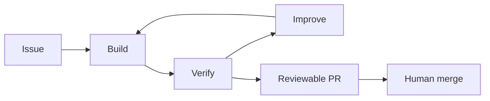

# Kaizen Agents

Kaizen Agents is an early-stage experiment for turning issues into high-quality, reviewable pull requests.

The target workflow is simple:

1. A user registers an issue.
2. The system builds a focused solution.
3. The solution is checked, reviewed, and improved before review.
4. A pull request is opened with enough context for a human maintainer.
5. The human merges the PR, and the original issue is resolved.

This organization is not trying to remove human ownership of repositories. It is trying to make AI-produced changes easier to trust, review, and merge.

## Core Idea

The system is built around three responsibilities:

> Builders build. Verifiers verify. Kaizen Loop coordinates.

## Core Projects

| Project | What it is | Standalone use | Current status |
| --- | --- | --- | --- |
| `builder-agent` | Implementation worker with an internal self-review and improvement loop. | Implement a requested change in a local workspace and produce structured build artifacts. | MVP implementation exists on a feature branch. |
| `verifier` | Independent evaluator for completed changes. | Evaluate an existing diff, PR, or local change and return a gate verdict. | Detailed specs exist; executable implementation is still pending. |
| `kaizen-loop` | Orchestrator for issue intake, workspaces, checks, verifier calls, and PR creation. | Coordinate GitHub Issue workflows through adapters. | CLI foundation exists; builder/verifier integration is not complete yet. |

Each project should be useful on its own. The integrated system should compose them through explicit contracts rather than turning them into one inseparable automation script.

## Intended Flow

```mermaid
flowchart LR
    subgraph BuilderAgent["builder-agent"]
        BA1["Spec analysis"]
        BA2["Plan"]
        BA3["Implementation"]
        BA4["Self-review"]
        BA5{"Ready?"}
        BA1 --> BA2 --> BA3 --> BA4 --> BA5
        BA5 -->|no| BA2
    end

    subgraph Mechanical["mechanical verification"]
        MV1["lint"]
        MV2["typecheck"]
        MV3["test"]
        MV4["build"]
        MV1 --> MV2 --> MV3 --> MV4
    end

    subgraph Verifier["verifier"]
        VF1["Spec review"]
        VF2["Architecture review"]
        VF3["Code review"]
        VF4["Test review"]
        VF5["Risk review"]
        VF1 --> VF2 --> VF3 --> VF4 --> VF5
    end

    Issue["GitHub Issue"] --> KL["kaizen-loop"]
    KL --> BA1
    BA5 -->|yes| MV1
    MV4 -->|failed| BA2
    MV4 -->|passed| VF1
    VF5 --> Gate{"Approved?"}
    Gate -->|no| BA2
    Gate -->|yes| PR["Pull Request"]
```

Builder self-review improves the work, but it is not the final gate. The final quality gate is layered:

1. Builder self-review
2. Mechanical verification
3. Independent verifier review
4. Human review

## Current Reality

The full flow is not implemented yet.

- `kaizen-loop` can already process issues, run an agent, run configured verification commands, and create PRs.
- `builder-agent` already has a standalone loop controller and schema-backed artifacts.
- `verifier` currently has design/spec documents, but no runnable verifier package yet.
- `kaizen-loop` does not yet call `builder-agent` or `verifier` through the intended contracts.

The next practical milestone is a vertical slice:

> GitHub Issue -> builder-agent -> mechanical verification -> verifier -> pull request.

## Documentation

Start here:

- [Docs Index](https://github.com/kaizen-agents-org/.github/blob/main/docs/README.md): map of the documentation set.
- [Architecture Notes](https://github.com/kaizen-agents-org/.github/blob/main/docs/architecture.md): system responsibilities and flow diagrams.
- [MVP Plan](https://github.com/kaizen-agents-org/.github/blob/main/docs/mvp-plan.md): staged plan to make the system usable.
- [Implementation Status](https://github.com/kaizen-agents-org/.github/blob/main/docs/implementation-status.md): what works today and what is missing.
- [Shared Skill Sync](https://github.com/kaizen-agents-org/.github/blob/main/docs/shared-skill-sync.md): how shared Kaizen skills are distributed to the core projects.
- [Organization Monitor](https://github.com/kaizen-agents-org/.github/blob/main/docs/org-monitor.md): how the cross-repository coordination monitor reports drift and files focused follow-up issues.
- [Design Decisions](https://github.com/kaizen-agents-org/.github/blob/main/docs/design-decisions.md): rationale behind the current direction.

## Shared Project Skills

The organization-level `.github` repository is the source of truth for shared Kaizen skills. The core projects vendor those skills under `skills/` so Codex can use the same issue-linked PR and bug-routing workflows inside `kaizen-loop`, `builder-agent`, and `verifier`.

When shared skills change, the sync workflow opens ready-for-review PRs in the core projects. The workflow does not merge those PRs automatically.

## Status

Kaizen Agents is early-stage, experimental, and actively changing. APIs, schemas, repository boundaries, and workflows may change as the implementation catches up with the architecture.
