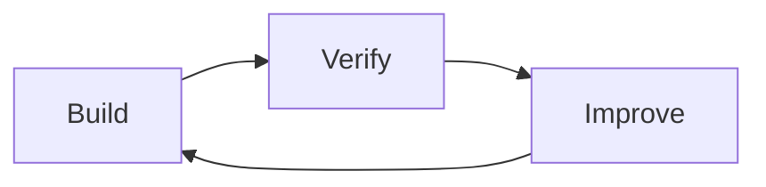
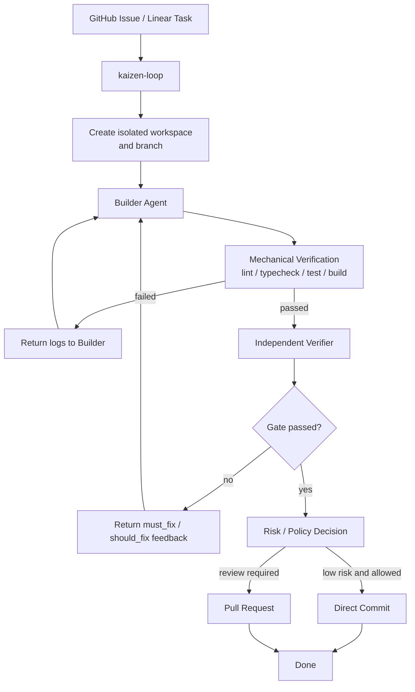
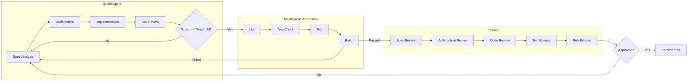
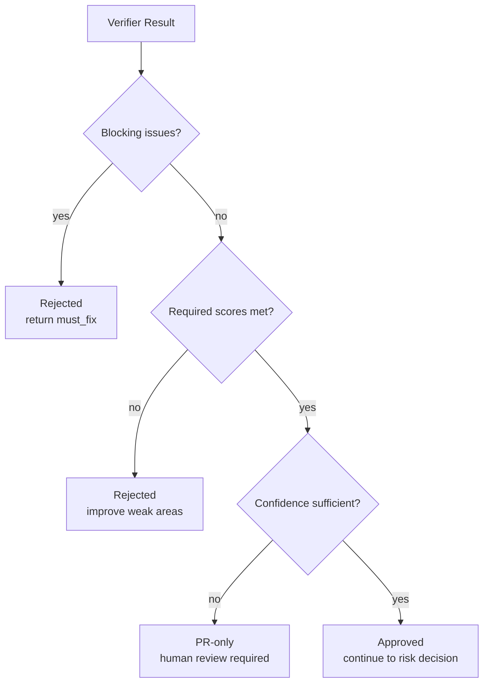

# Kaizen Agents

Experimental autonomous software development workflows built around **Build -> Verify -> Improve**.

Kaizen Agents is an early-stage organization for exploring continuous improvement loops in software development. The core idea is to keep building, verification, and orchestration as separate responsibilities so automated work can be improved without letting one agent become the only judge of its own output.

This is work in progress. The workflows, schemas, policies, and repository boundaries are expected to change as the system matures.

## Product Goal

The goal is a workflow where a user registers an issue, the system proposes a high-quality solution as a pull request, and a human resolves the original problem by reviewing and merging that PR.

The system should not bypass human ownership of the repository. It should prepare a solution that is clear, verified, reviewable, and safe enough for a human maintainer to merge with confidence.

## What We Are Building

- **Build**: a builder agent implements an approved task in an isolated workspace.
- **Verify**: mechanical checks and an independent verifier evaluate the result.
- **Improve**: structured feedback loops back into the builder until the change is acceptable or requires human input.

## Core Repositories

| Repository | Responsibility | Status |
| --- | --- | --- |
| `kaizen-loop` | Coordinates task intake, workspace setup, agent execution, verification, risk decisions, commits, and pull requests. | Early-stage |
| `builder-agent` | Builds approved changes, runs an internal self-review loop, and returns structured self-review output. | Experimental |
| `verifier` | Independently reviews the completed change and returns a gate verdict. It does not implement changes. | Work in progress |

## Component Roles

- **`kaizen-loop`** is the orchestrator. It selects a task, prepares an isolated workspace, runs the builder, executes mechanical verification, calls the verifier, and applies the repository policy for PRs or direct commits.
- **`builder-agent`** is the implementation worker. It understands the task, designs the change, writes code, adds or updates tests, and self-reviews until its configured threshold is met.
- **`verifier`** is the independent quality gate. It reviews the completed change for spec fit, architecture, code quality, tests, maintainability, and risk, then returns an approval, rejection, or PR-only result.

## Workflow Overview

## Responsibility Pipeline

Builders build. Verifiers verify. Kaizen Loop coordinates.

Builder self-review is useful, but it is not the final quality gate. The final gate is layered:

1. Builder self-review
2. Mechanical verification
3. Independent verifier review
4. Human review or repository policy

## Gate Decision Model

## Design Principles

- Separate implementation from evaluation.
- Treat self-review as useful but insufficient.
- Prefer objective verification where possible.
- Keep approval gates explicit.
- Preserve user changes.
- Keep implementation scope constrained.
- Make every loop observable.

## Current Status

Kaizen Agents is early-stage, experimental, and actively changing. The current focus is defining clear responsibility boundaries, useful feedback loops, and explicit quality gates before treating the workflow as production-ready automation.

## Planned Direction

- `builder-agent` skill and CLI workflows
- `verifier` CLI and structured gate reports
- `kaizen-loop` orchestration over GitHub Issues and Linear tasks
- Isolated workspace and branch management
- PR creation and merge-readiness workflows
- Policy-based low-risk direct commits

For deeper workflow details, see [Architecture Notes](https://github.com/kaizen-agents-org/.github/blob/main/docs/architecture.md).
For the staged path to a usable end-to-end workflow, see [MVP Plan](https://github.com/kaizen-agents-org/.github/blob/main/docs/mvp-plan.md).
For the design decisions behind the current direction, see [Design Decisions](https://github.com/kaizen-agents-org/.github/blob/main/docs/design-decisions.md).
